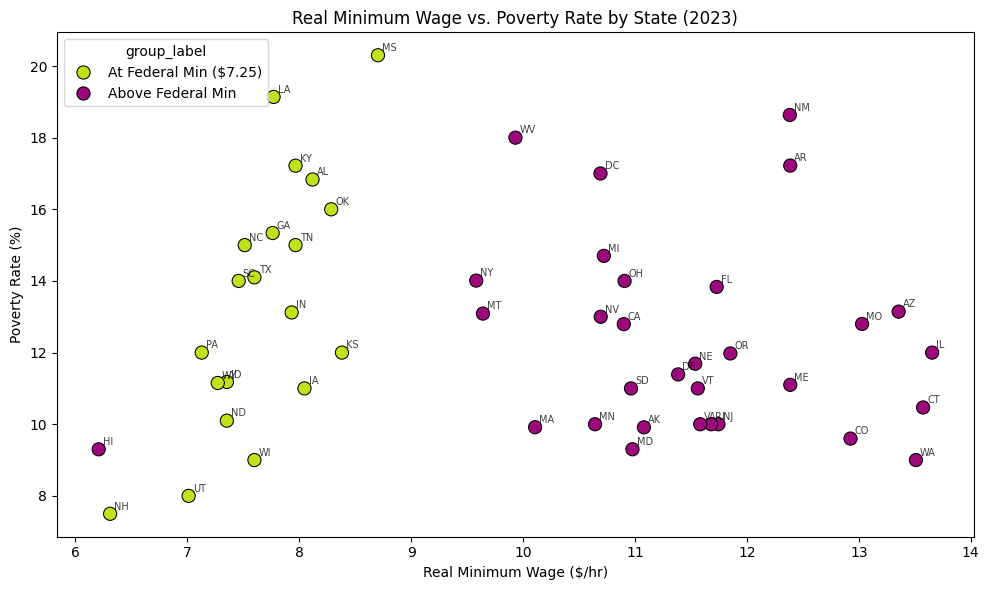
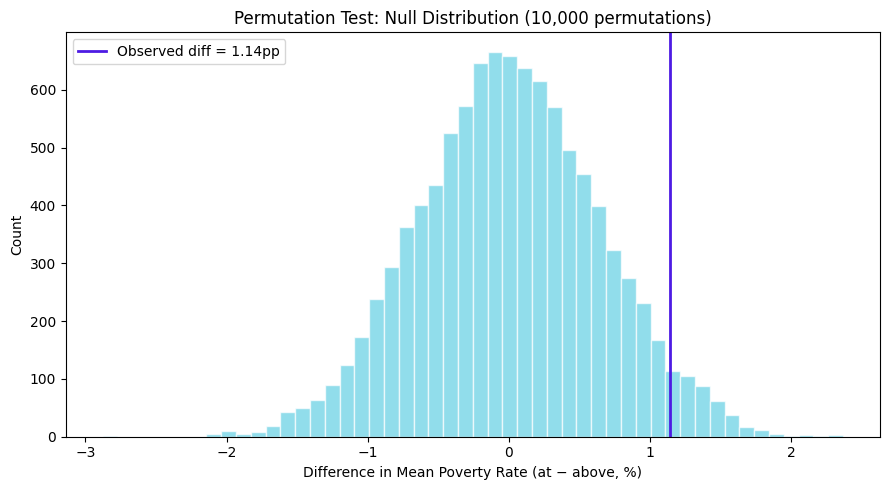
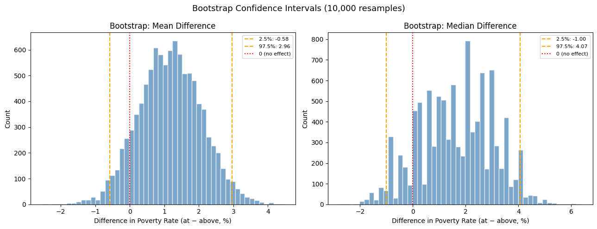

# Minimum Wage and State Poverty Rates (2023)

## Project Overview

This project investigates whether U.S. states with minimum wages above the federal minimum wage of **$7.25 per hour** have lower poverty rates than states that remain at the federal minimum.

The analysis uses state-level 2023 data and combines **data cleaning, exploratory data analysis, a permutation test, and bootstrap confidence intervals** to evaluate the observed difference in poverty rates between the two groups.

> **Research question:** Do states with minimum wages above the federal minimum ($7.25/hr) have lower poverty rates than states that default to the federal minimum?

---

## Hypotheses

### Null hypothesis ($H_0$)
There is no difference in mean poverty rates between states with minimum wages above the federal minimum and states at the federal minimum. Any observed difference is due to chance.

### Alternative hypothesis ($H_1$)
States with minimum wages above the federal minimum ($7.25/hr) have lower mean poverty rates than states at the federal minimum.

---

## Dataset

The notebook analyzes **51 observations representing the 50 states plus the District of Columbia** after removing a duplicate District of Columbia record.

### Data sources recorded in the notebook

| Variable | Source |
|---|---|
| `min_wage_2023` | U.S. Department of Labor |
| `unemployment_rate_2023` | U.S. Bureau of Labor Statistics |
| `cost_of_living_index_2023` | Missouri Economic Research & Information Center (MERIC) |
| `median_household_income_2023` | U.S. Census Bureau, ACS 2023 |
| `population_2023` | U.S. Census Bureau, ACS 2023 |
| `num_below_poverty_line_2023` | U.S. Census Bureau, ACS 2023 |

The notebook loads the data from:

```text
state_wages_poverty_Dataset.csv
```

### Original variables

| Column | Description |
|---|---|
| `state` | State name |
| `state_abbr` | State abbreviation |
| `region` | U.S. region |
| `min_wage_2023` | Reported state minimum wage in 2023 |
| `unemployment_rate_2023` | State unemployment rate |
| `cost_of_living_index_2023` | 2023 cost-of-living index |
| `median_household_income_2023` | Median household income |
| `population_2023` | State population |
| `num_below_poverty_line_2023` | Number of people below the poverty line |
| `notes_min_wage` | Notes associated with the minimum-wage data |

---

## Data Cleaning

The notebook identifies and addresses the following issues:

| Issue | Column / observation | Cleaning action |
|---|---|---|
| Dollar signs | `min_wage_2023`, `median_household_income_2023` | Remove `$` and convert to numeric |
| Percentage signs | `unemployment_rate_2023` | Remove `%` and convert to numeric |
| Duplicate record | District of Columbia | Remove duplicate |
| Below federal floor | Georgia and Wyoming reported `$5.15` | Apply federal minimum of `$7.25` |
| Missing/irrelevant notes | `notes_min_wage` | Drop the column; it contains 37 missing values |

The federal minimum used in the analysis is:

```python
F_min_wage = 7.25
```

The notebook creates `effective_min_wage` by applying a federal wage floor so that the analytical wage does not fall below $7.25.

---

## Derived Variables

### 1. Poverty rate

The state poverty rate is calculated as:

$$
\text{Poverty Rate} = \frac{\text{Number Below Poverty Line}}{\text{Population}} \times 100
$$

This produces the percentage of each state's population below the poverty line.

### 2. Real minimum wage

The notebook adjusts the effective minimum wage using the cost-of-living index:

$$
\text{Real Minimum Wage} = \frac{\text{Effective Minimum Wage}}{\text{Cost of Living Index}/100}
$$

### 3. Federal-minimum indicator

States are classified as either:

- **At Federal Min ($7.25)**
- **Above Federal Min**

The notebook creates `above_federal` and `group_label` to support this comparison.

---

# Exploratory Data Analysis

## Poverty Rate by Minimum-Wage Group

The notebook compares poverty rates for the two minimum-wage groups.



### Main observations from the notebook

- States above the federal minimum have approximately **1.14 percentage points lower average poverty** than states at the federal minimum.
- The **At Federal Min** group has greater spread in poverty rates.
- The minimum poverty rate in the federal-minimum group is **7.5%**, showing that not every low-wage state has high poverty.

### Group summary

| Group | n | Mean Poverty Rate | Median | Standard Deviation | Minimum | Maximum |
|---|---:|---:|---:|---:|---:|---:|
| Above Federal Min | 31 | 12.25% | 11.69% | 2.67 | 9.00% | 18.63% |
| At Federal Min ($7.25) | 20 | 13.40% | 13.56% | 3.53 | 7.50% | 20.30% |

The observed difference is approximately:

```text
13.40% - 12.25% = 1.14 percentage points
```

---

## Real Minimum Wage vs. Poverty Rate

The notebook also examines the relationship between the cost-of-living-adjusted minimum wage and poverty rate.

### Interpretation recorded in the notebook

- There is a **slight downward trend**: as real minimum wage increases, poverty rate tends to decrease.
- **Mississippi (MS)** and **Louisiana (LA)** stand out as high-poverty, low-wage states.
- **New Hampshire (NH)** is identified as an outlier: it is at the federal minimum but has relatively low poverty, illustrating the influence of broader state-level economic conditions.
- The relationship is **not perfectly linear**, indicating that other factors influence poverty rates.

---

# Permutation Test

## Why a permutation test?

The permutation test asks:

> If there were truly no difference between the two groups, how often would we see a difference as large as the one observed?

### Procedure

1. Calculate the observed difference in mean poverty rates.
2. Randomly shuffle the group labels.
3. Recalculate the difference in means.
4. Repeat the process **10,000 times**.
5. Determine the proportion of permutations producing a difference at least as large as the observed difference.

### Test statistic

The notebook defines the statistic as:

```text
Mean poverty rate (At Federal Min)
− Mean poverty rate (Above Federal Min)
```



## Permutation test results

| Statistic | Result |
|---|---:|
| Observed difference | 1.14 percentage points |
| Permutations | 10,000 |
| One-tailed p-value | 0.0365 |
| Significance level | 0.05 |
| Decision | Reject $H_0$ |

### Interpretation

The notebook reports that only about **3.65%** of random permutations produced a difference as large as 1.14 percentage points. Because the p-value is below 0.05, the null hypothesis is rejected under this test.

This provides evidence that the observed group difference is unlikely to be explained by random group assignment alone.

---

# Bootstrap Confidence Intervals

The notebook uses bootstrap resampling to examine uncertainty in the difference between groups. It calculates confidence intervals for both:

1. **Mean difference**
2. **Median difference**

The analysis uses **10,000 bootstrap resamples**.

### Why bootstrap?

The notebook notes that the central limit theorem provides a normal approximation for means, but not directly for medians. Because the sample contains only about 20 states in the smaller group and poverty-rate distributions are not perfectly symmetric, bootstrap resampling is used as a model-free approach.



## Bootstrap results

| Metric | 95% Confidence Interval |
|---|---|
| Mean difference | [-0.57, 2.90] percentage points |
| Median difference | [-1.00, 4.03] percentage points |

Both intervals include **0**. Therefore, the bootstrap analysis cannot rule out the possibility that the true difference is zero.

The notebook attributes the wide intervals to the relatively small sample size of **51 states**.

---

# Statistical Interpretation

The project deliberately considers both inferential approaches rather than relying on one statistic.

### Permutation test

The permutation test gives **p = 0.0365**, which is below 0.05, supporting rejection of the null hypothesis for the observed mean difference.

### Bootstrap intervals

Both 95% bootstrap confidence intervals include zero, indicating uncertainty around the magnitude and direction of the effect.

### Overall interpretation

The results are best described as **suggestive but not conclusive**. The analysis finds an association between being above the federal minimum wage and having a lower state-level poverty rate, but it does **not establish that higher minimum wages cause lower poverty**.

---

# Conclusion

### Answer to the research question

> **Do states with higher minimum wages have lower poverty rates?**

**Yes, but weakly supported.**

States above the federal minimum wage have approximately **1.14 percentage points lower average poverty** than states at the federal minimum. The permutation test reports a statistically significant difference (**p = 0.0365**).

However, both bootstrap confidence intervals include zero, meaning that the effect size remains uncertain. The notebook therefore concludes that the finding is **suggestive rather than conclusive**.

---

# Limitations

### 1. Confounding variables

States with higher minimum wages may also differ in wealth, urbanization, geography, labor markets, and other socioeconomic characteristics. These factors may independently influence poverty.

Therefore, the observed relationship cannot be interpreted as causal.

### 2. Small sample size

The analysis contains only **51 state-level observations**, limiting statistical power and contributing to wide bootstrap intervals.

### 3. Ecological fallacy

The analysis is conducted at the state level. A state-level relationship does not necessarily mean that an individual minimum-wage worker is less likely to experience poverty.

### 4. Cross-sectional design

The analysis is a **single-year snapshot of 2023**. A longitudinal design following states before and after minimum-wage changes could provide stronger evidence.

### 5. Within-state cost-of-living variation

The MERIC cost-of-living measure is a statewide average and does not capture all differences between cities, suburbs, and rural areas within a state.

---

# Reproducibility

## Requirements

The notebook uses Python and the following libraries:

```text
pandas
numpy
matplotlib
seaborn
jupyter
```

Install the core dependencies with:

```bash
pip install pandas numpy matplotlib seaborn jupyter
```

## Run the notebook

1. Place `project.ipynb` and `state_wages_poverty_Dataset.csv` in the same project directory.
2. Start Jupyter Notebook:

```bash
jupyter notebook
```

3. Open `project.ipynb`.
4. Run the cells from top to bottom.

---

# Recommended Repository Structure

```text
minimum-wage-poverty-analysis/
│
├── project.ipynb
├── state_wages_poverty_Dataset.csv
├── README.md
│
└── figures/
    ├── poverty_rate_by_group.png
    ├── permutation_test.png
    └── bootstrap_confidence_intervals.png
```

The notebook remains the **complete executable analysis**, while this README provides the project narrative, dataset documentation, important visual results, and interpretation.

---

# Project Workflow

```text
Raw Dataset
     ↓
Inspect Data
     ↓
Clean Variables & Remove Duplicate
     ↓
Apply Federal Wage Floor
     ↓
Calculate Poverty Rate
     ↓
Calculate Real Minimum Wage
     ↓
Create Federal-Minimum Groups
     ↓
Exploratory Data Analysis
     ↓
Permutation Test (10,000)
     ↓
Bootstrap Confidence Intervals (10,000)
     ↓
Interpret Results
     ↓
Conclusion & Limitations
```

---

# Technologies Used

- **Python**
- **Jupyter Notebook**
- **Pandas** — data loading, cleaning, and transformation
- **NumPy** — numerical calculations and resampling
- **Matplotlib** — visualization
- **Seaborn** — statistical visualization
- **Permutation testing** — hypothesis testing
- **Bootstrap resampling** — uncertainty estimation

---

# Key Results at a Glance

| Measure | Result |
|---|---:|
| Total observations | 51 |
| Above federal minimum | 31 states |
| At federal minimum | 20 states |
| Mean poverty — above federal minimum | 12.25% |
| Mean poverty — federal minimum | 13.40% |
| Observed difference | 1.14 percentage points |
| Permutation repetitions | 10,000 |
| Permutation p-value | 0.0365 |
| Bootstrap resamples | 10,000 |
| Mean-difference 95% CI | [-0.57, 2.90] pp |
| Median-difference 95% CI | [-1.00, 4.03] pp |
| Overall conclusion | Suggestive but not conclusive |

---

# Final Takeaway

The 2023 state-level analysis finds that states above the federal minimum wage had a lower average poverty rate than states at the federal minimum. The permutation test provides evidence of a statistically significant difference, while the bootstrap confidence intervals show substantial uncertainty around the effect.

**The project supports an association, not a causal claim. The overall finding is suggestive but not conclusive.**
